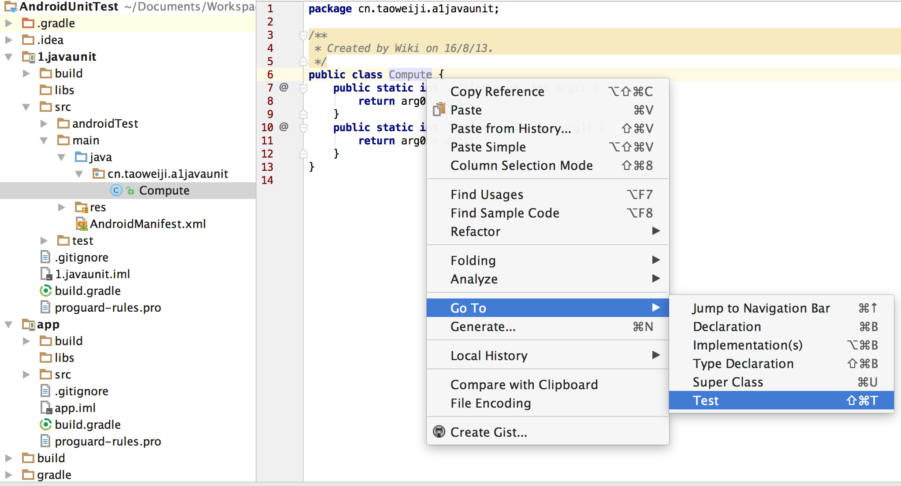
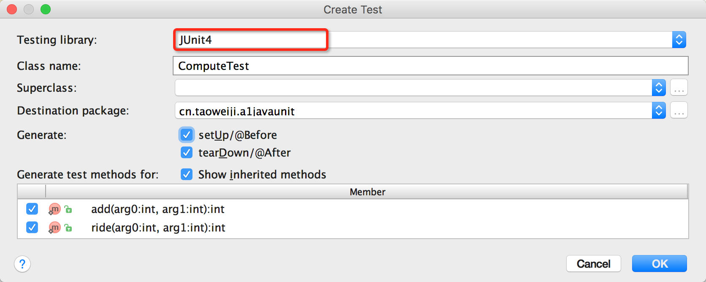
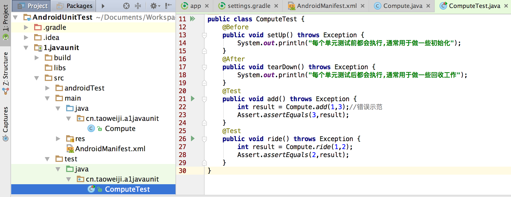
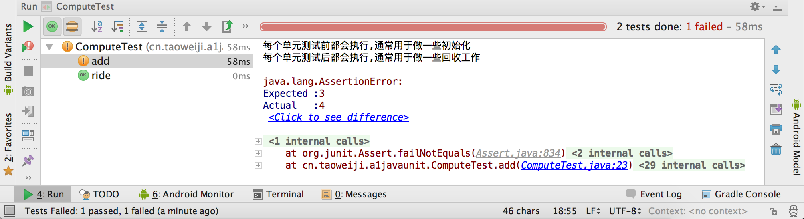

所有的代码都需要进行测试。每位开发者都会执行某种类型的测试，来查看代码是否可以正常工作。使用单元测试的开发者能够根据需要执行这些测试，以确保新编写的代码可以正常工作并且不会破坏已有的测试。

### 单元测试的必要性

单元测试的主要目的就是验证你的应用程序可以按预期的方式正常运行，以及尽可能地发现错误。尽管功能测试也可以做到这一点，但是单元测试更加强大，并且用途更加丰富，它能做的不仅仅是验证应用程式的正常运行，单元测试还可以：

1. 带来更高的测试覆盖率
2. 提高团队效率
3. 监测衰退和减少调试
4. 自信地重构
5. 改进实现
6. 将预期的行为文档化

### 第一个Java单元测试用例

需要测试的两个方法

```java
public class Compute {
    public static int add(int arg0, int arg1) {
        return arg0 + arg1;
    }
    public static int ride(int arg0, int arg1) {
        return arg0 * arg1;
    }
}
```

在类名处右击鼠标，选择`Go To`  >  `Test` 或者直接使用快捷键



点击`Created New Test…`，单元测试的框架有好多种，最常用的是JUnit3和JUnit4，androidTest只支持JUnit3，而JVM两者都支持。



点击ok后会弹出选择创建测试用例的目录，这里有两个选择，androidTest和test，androidTest是运行在Android设备上测试的，test是在jvm上进行测试。我们这里选择test。点击ok，就会在src/test文件夹生成一个单元测试类，项目大体的结构如下：



右击ComputeTest文件，点击`Run 'ComputeTest'`即可运行这个单元测试。



到这里，第一个单元测试就已经完成了，从上图可以看到，1+3我们预测结果是3，实际上是4，所以这个单元测试不通过。

##### 注释说明

1. JUnit注释提供了资源初始化和回收方法：@Before、@BeforeClass、@After和@AfterClass。
2. 我们添加@Test注释，把这个方法标记为一个单元测试方法。

##### 断言说明

用来验证测试结果的方法`Assert.assertXXX`叫做断言，提供了好多验证方法，Assert.assertEquals()、Assert.assertNotNull()、Assert.assertTrue()、….。

####  参数化测试

Parameterized（参数化）的测试运行器允许你使用不同的参数多次运行同一个测试。

```java
@RunWith(value = Parameterized.class)
public class ParameterizedTest {
    private int expected;
    private int param0;
    private int param1;
    @Parameterized.Parameters
    public static Collection<Integer[]> getTestParameters() {
        return Arrays.asList(new Integer[][]{
                {2, 1, 1},
                {4, 2, 2},
                {5, 3, 3}
        });
    }
    public ParameterizedTest(int expected, int param0, int param1) {
        this.expected = expected;
        this.param0 = param0;
        this.param1 = param1;
    }
    @Test
    public void add() throws Exception {
        int result = Compute.add(param0, param1);//错误示范
        Assert.assertEquals(expected, result);
    }
}
```

运行结果：


#### 用Suite来组合测试

JUnit设计Suite的目的就是为了运行一个或者多个测试用例。

```java
@RunWith(Suite.class)
@Suite.SuiteClasses({ComputeTest.class,ParameterizedTest.class})
public class AllTest {
}
```

### 第一个Android单元测试

配置

```
defaultConfig {
    ...
    multiDexEnabled true
    testInstrumentationRunner "com.android.test.runner.MultiDexTestRunner"
}
```


```
dependencies {
    compile fileTree(include: ['*.jar'], dir: 'libs')
    testCompile 'org.robolectric:robolectric:3.1-rc1'
    testCompile 'org.mockito:mockito-all:2.0.2-beta'
    testCompile 'junit:junit:4.12'
    testCompile 'org.json:org.json:2.0'
}
```

##### 问题

1. JSON解析出问题
2. Multidex项目配置


### 在JVM运行Android单元测试：Robolectric

每次都要编译运行安装apk，效率非常低，我们希望能够在电脑直接运行单元测试，提高测试开发的效率。

### 编写脚手架：回调模式测试

Android Sync Http例子说明

### 编写代码的全新方式：Mock objects


​	Mocks测试技术，支持细颗粒度单元测试，还能迫使你编写优秀的代码。使用Mocks不仅仅是一种单元测试策略，它更是一种编写代码的全新方式，编写代码的全新方式，编写代码的全新方式，重要的事情说三遍。

​	它最大的特点就是“隔离测试”，它可以帮助我们先测试一部分的代码，无须等到其它代码全部完成。还记得一位同事曾经吐槽，也是我们一直的比较难改变的事情，就是服务端API还没有实现，我们就需要做客户端开发，无法与服务端进行交互，开发难以进行顺利，利用Mocks，就可以很好解决了这个问题，编写Mocks类，模拟HttpClient网络请求，无须等待服务API实现就可以把除了网络层外的全部逻辑进行测试。

### Mock框架：Mockito

使用Mock objects方式进行测试就意味着我们必须编写大量的Mock类，这效率太低了，程序员都不爱干，我们可以使用Mockito框架来帮我们减轻工作。


### 怎样的架构适合单元测试？

#### MVP改造


#### RxJava怎么测试


#### ORM数据库怎么测试


#### Dagger2对单元测试影响


